# File Connector

A Python-based file synchronization connector that fetches files from external APIs (Autodesk Construction Cloud, Google Drive) and stores metadata in Supabase. Files are synced on a configurable schedule.

## 🚀 Quick Start

### Development Setup

1. **Prerequisites**
   ```bash
   python 3.9+
   pip
   Supabase account
   ```

2. **Install Dependencies**
   ```bash
   python3 -m venv venv
   source venv/bin/activate  # On Windows: venv\Scripts\activate
   pip install -r requirements.txt
   ```

3. **Configure Environment**
   ```bash
   cp env.example .env
   ```
   Update `.env` with your Supabase credentials:
   ```bash
   CONNECTOR_SUPABASE_URL=your_project_url
   CONNECTOR_SUPABASE_ANON_KEY=your_anon_key
   CONNECTOR_SUPABASE_SERVICE_ROLE_KEY=your_service_role_key  # For system operations
   ```

4. **Set API Credentials**
   ```yaml
   # Autodesk Construction Cloud
   CONNECTOR_AUTODESK_CLIENT_ID=your_client_id
   CONNECTOR_AUTODESK_CLIENT_SECRET=your_client_secret
   
   # Google Drive (path to service account JSON)
   CONNECTOR_GOOGLE_DRIVE_CREDENTIALS_PATH=./credentials/google-service-account.json
   ```

5. **Launch in Development**
   ```bash
   python -m src.connector.main
   ```
   
   The application will start on `http://localhost:8080`
   - Health: `GET /health`
   - Status: `GET /status`

## 🔧 How It Works

### Architecture Overview

```mermaid
graph TD
    A["🔌 Connector"] --> B["📊 Supabase Database"]
    A --> C["🏗️ Autodesk API"]
    A --> D["💾 Google Drive API"]
    
    B --> E["endpoints table"]
    B --> F["files table"] 
    B --> G["sync_logs table"]
    B --> H["oauth_tokens table"]
    
    C --> |"OAuth 2.0"| I["🔑 Authentication"]
    D --> |"Service Account"| I
    I --> A
```


### Database Schema (Supabase)

The system uses Supabase with the following schema:

#### 1. `endpoints` Table
```sql
CREATE TABLE endpoints (
    id UUID PRIMARY KEY DEFAULT gen_random_uuid(),
    name TEXT NOT NULL,
    endpoint_type TEXT NOT NULL,
    project_id TEXT NOT NULL,
    user_id UUID NOT NULL,
    description TEXT,
    enabled BOOLEAN NOT NULL DEFAULT true,
    schedule_type TEXT NOT NULL DEFAULT 'interval',
    schedule_cron TEXT NOT NULL DEFAULT '*/5 * * * *',
    interval_minutes INTEGER DEFAULT 5,
    file_types JSONB DEFAULT '["*"]',
    max_files_per_sync INTEGER DEFAULT 1000,
    endpoint_config JSONB NOT NULL DEFAULT '{}',
    tags JSONB DEFAULT '[]',
    last_sync_status TEXT NOT NULL DEFAULT 'pending'
);
```

#### 2. `oauth_tokens` Table
```sql
CREATE TABLE oauth_tokens (
    id UUID PRIMARY KEY DEFAULT gen_random_uuid(),
    endpoint_id UUID NOT NULL REFERENCES endpoints(id),
    access_token TEXT NOT NULL,
    refresh_token TEXT,
    token_type TEXT DEFAULT 'Bearer',
    scope TEXT,
    expires_at TIMESTAMP NOT NULL,
    is_active BOOLEAN DEFAULT true
);
```

#### 3. `files` Table
```sql
CREATE TABLE files (
    id UUID PRIMARY KEY DEFAULT gen_random_uuid(),
    endpoint_id UUID NOT NULL REFERENCES endpoints(id),
    external_file_id TEXT NOT NULL,
    file_name TEXT NOT NULL,
    file_path TEXT,
    file_link TEXT NOT NULL,
    file_size BIGINT,
    file_type TEXT,
    mime_type TEXT,
    external_created_at TIMESTAMP,
    external_updated_at TIMESTAMP,
    sync_status TEXT DEFAULT 'completed',
    file_metadata JSONB DEFAULT '{}'
);
```

### Row Level Security (RLS)

The system uses Supabase RLS policies to ensure data isolation:

```sql
-- Endpoints: Users can only access their own endpoints
CREATE POLICY "Users can view their own endpoints" 
ON endpoints FOR SELECT 
USING (auth.uid()::text = user_id);

-- Files: Users can only access files from their endpoints
CREATE POLICY "Users can access files from their endpoints" 
ON files FOR ALL 
USING (
    EXISTS (
        SELECT 1 FROM endpoints 
        WHERE endpoints.id = files.endpoint_id 
        AND auth.uid() = endpoints.user_id
    )
);
```

### Adding New Endpoints

You can add endpoints in several ways:

1. **Using Python Script**
   ```bash
   python scripts/add_endpoint_to_supabase.py
   ```

2. **Direct SQL in Supabase Dashboard**
   ```sql
   INSERT INTO endpoints (
       name,
       endpoint_type,
       project_id,
       user_id,
       endpoint_config
   ) VALUES (
       'Project 0001',
       'autodesk_construction_cloud',
       'project_0001',
       'your-user-uuid',
       '{
           "client_id": "your_client_id",
           "project_id": "b.your-project-id"
       }'
   );
   ```

3. **Using the API**
   ```python
   from supabase import create_client

   supabase = create_client(
       supabase_url="your-project-url",
       supabase_key="your-anon-key"
   )

   endpoint_data = {
       "name": "Project 0001",
       "endpoint_type": "autodesk_construction_cloud",
       "project_id": "project_0001",
       "user_id": "your-user-uuid",
       "endpoint_config": {
           "client_id": "your_client_id",
           "project_id": "b.your-project-id"
       }
   }

   result = supabase.table("endpoints").insert(endpoint_data).execute()
   ```

### OAuth Token Management

OAuth tokens are stored securely in Supabase:

1. **Token Storage**
   - Tokens stored in `oauth_tokens` table
   - One active token per endpoint
   - Automatic token refresh

2. **Token Security**
   - RLS ensures tokens are only accessible to authorized users
   - Service role key used for system operations
   - Tokens never exposed in logs or config

3. **Token Refresh Flow**
   ```python
   # Example token refresh
   new_token = await supabase.table("oauth_tokens").update({
       "access_token": "new_token",
       "refresh_token": "new_refresh_token",
       "expires_at": "new_expiry_time"
   }).eq("endpoint_id", endpoint_id).execute()
   ```

## 🐳 Deployment

### Environment Variables

Required environment variables for production:

```bash
# Supabase Configuration
CONNECTOR_SUPABASE_URL=your_project_url
CONNECTOR_SUPABASE_ANON_KEY=your_anon_key
CONNECTOR_SUPABASE_SERVICE_ROLE_KEY=your_service_role_key

# API Credentials
CONNECTOR_AUTODESK_CLIENT_ID=your_client_id
CONNECTOR_AUTODESK_CLIENT_SECRET=your_client_secret

# Application Settings
CONNECTOR_ENVIRONMENT=production
CONNECTOR_LOG_LEVEL=INFO
CONNECTOR_MAX_CONCURRENT_SYNCS=10
```

### Docker Deployment

```bash
# Build image
docker build -t file-connector .

# Run container
docker run -d \
  -p 8080:8080 \
  --env-file .env \
  file-connector
```

### Docker Compose

```yaml
version: '3.8'
services:
  connector:
    build: .
    ports:
      - "8080:8080"
    env_file: .env
    volumes:
      - ./logs:/app/logs
    restart: unless-stopped
```

## 📊 Monitoring

### Health Checks
- `GET /health` - Basic health check
- `GET /status` - Detailed system status

### Supabase Queries

Useful monitoring queries:

```sql
-- Get endpoints with token status
SELECT 
    e.name,
    e.endpoint_type,
    e.enabled,
    e.last_sync_status,
    CASE 
        WHEN t.expires_at > NOW() THEN 'Valid'
        WHEN t.expires_at IS NOT NULL THEN 'Expired'
        ELSE 'No Token'
    END as token_status
FROM endpoints e
LEFT JOIN oauth_tokens t ON e.id = t.endpoint_id AND t.is_active = true;

-- Get sync statistics
SELECT 
    endpoint_id,
    COUNT(*) as total_files,
    SUM(file_size) as total_size,
    MAX(external_updated_at) as latest_update
FROM files
GROUP BY endpoint_id;
```

## 🧪 Testing

```bash
# Test Supabase connection
python scripts/test_supabase_integration.py

# Test specific endpoint
python scripts/test_endpoints.py --type autodesk_construction_cloud

# Run all tests
python -m pytest tests/ -v
```

## 📚 Documentation

- [OAuth Setup](OAUTH_SETUP.md)
- [API Documentation](API.md)
- [Deployment Guide](DEPLOYMENT.md)

For detailed OAuth setup instructions, see `OAUTH_SETUP.md`.